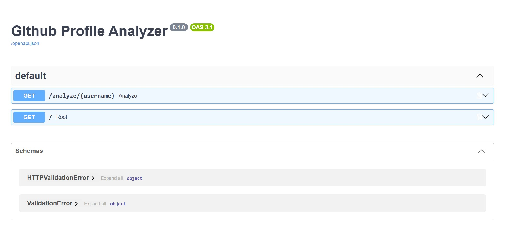

## API Preview


# GitHub Profile Analyzer API

A FastAPI-based REST API that analyzes any GitHub user's public profile and returns meaningful stats.

## Tech Stack
- **Python** — Core language
- **FastAPI** — Web framework
- **httpx** — Async HTTP client for GitHub API calls
- **In-memory caching** — Avoids redundant GitHub API calls

## Features
- Fetches real-time GitHub profile data
- Analyzes top programming languages across all repos
- Finds most starred repository
- Calculates total and average stars
- In-memory response caching
- Auto-generated interactive API docs (Swagger UI)

## Run Locally
```bash
pip install fastapi uvicorn httpx
uvicorn main:app --reload
```
API runs on `http://localhost:8000`

## API Endpoints
| Method | Endpoint | Auth | Description |
|--------|----------|------|-------------|
| GET | /analyze/{username} | API Key | Analyze GitHub profile |
| GET | /history | No | Last 10 searches |
| GET | /stats | No | Most searched profiles |
| GET | /docs | No | Interactive Swagger UI |

## Authentication
Protected endpoints require `x-api-key` header:
```
x-api-key: your-api-key
```

## Example
```
GET /analyze/torvalds
```
```json
{
  "username": "torvalds",
  "name": "Linus Torvalds",
  "followers": 236000,
  "top_languages": ["C", "Python", "Shell"],
  "total_stars": 172000
}
```
